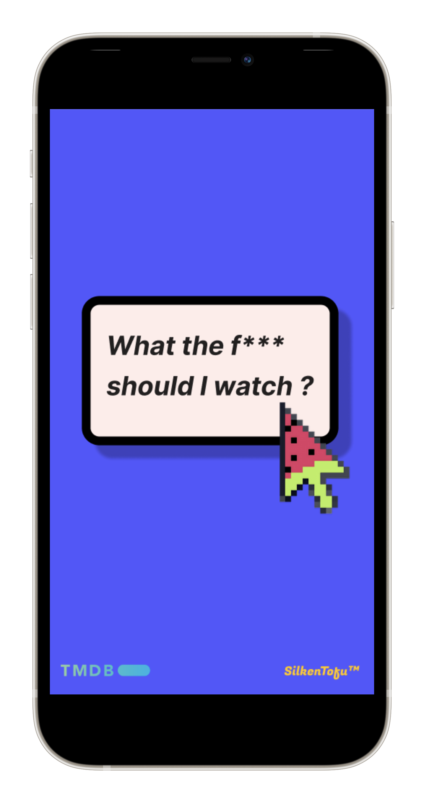

# What the f*** should I watch ?

## Overview

Fun little (made by womxn) film randomiser application inspired by ["Where the f*** should I go eat?"](http://wtfsigte.com/) and consequent noughties corners of the internet. For those with Netflix fatigue. For those wishing to see more gems made by womxn. Enjoy! 

### Process

#### Stage 1:

##### Design

I had a lot of fun making the design for the app in [Figma](https://www.figma.com/file/GfhSUCNhyxbnGCkMImUDuM/What-Should-I-Watch%3F%3F), incorporating a fun, simple ~millenial~ aesthetic with bold colours, a sans-serif font, and throwback pixellated icons: 

###### Mobile

###### Desktop

